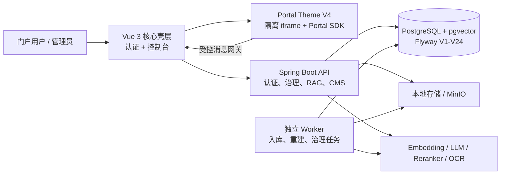
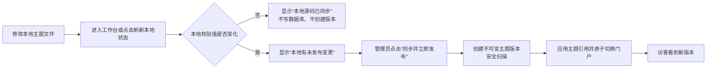

# KMA Mini · AI 知识库

KMA Mini（Knowledge Management AI）是一个面向本地开发、学习和内部演示的单实例 RAG 知识库。它把内容治理、知识处理、检索问答、门户 CMS 与运行运维整合在同一套服务中。

> **边界声明**：KMA Mini 不是生产就绪版本。它不提供多租户数据隔离、生产容量承诺或完整外部依赖演练。生产使用应回到完整 KMA 仓库和正式交付流程。

- 知识门户：`/p/{siteKey}/**`；`siteKey` 是 CMS 站点和视觉配置键，**不是**租户、数据库或数据隔离边界。
- 治理后台：`/console/**`；覆盖内容、知识技术、门户、权限、模型、任务、存储与审计。
- 兼容路由：旧 `/portal/**` 会重定向至默认门户站点。

## 快速导航

- [架构与代码阅读指南](docs/architecture.md)
- [全角色使用说明手册](docs/KMA-Mini-使用说明手册.md)
- [可打印 Word 手册](docs/KMA-Mini-使用说明手册.docx)
- [核心流程图 Mermaid 源文件](docs/diagrams/)
- [环境变量模板](.env.example)

## 架构总览



后端是**模块化单体**：一个 Maven 工程、一个可执行 JAR；同一 JAR 可作为 API 进程或无 Web 的 Worker 进程启动。前端是 Vue 3 单页应用，按模块注册路由并由权限驱动菜单与页面访问。

## 核心能力

| 领域 | 能力 |
| --- | --- |
| 身份与访问 | 本地账号、Argon2id、短期 Access Token、旋转 Refresh Token、RBAC、组织归属、知识空间 ACL |
| 内容治理 | 内容草稿、审核、发布、下线、效力状态、专题、收藏、阅读历史与门户可见性 |
| 知识处理 | 文件/文本入库、解析、分块、关键词、向量、版本化切换、任务租约、重试与死信 |
| RAG | 中文词项分析、全文/向量召回、RRF 混合排序、可选重排、引用复核、无证据拒答、SSE 流式回答 |
| 门户 CMS | Portal Theme V4 全站 HTML/Liquid/KMA 标签主题、隔离 JavaScript、Portal SDK、主题目录、ZIP 导入导出、DeepSeek 多文件提案、真实预览、一键发布与历史回退 |
| 运维 | 健康探针、Prometheus 指标、调用与安全审计、存储对账、模型 Profile、RAG 评测 |

## 技术栈

| 层级 | 主要技术 |
| --- | --- |
| 后端 | JDK 21、Spring Boot 3.5、Spring Security、JDBC、MyBatis-Plus、Flyway、Springdoc |
| 数据 | PostgreSQL 16+、pgvector、Flyway V1–V24 |
| 文档处理 | PDFBox、Apache POI、可选 OCR、Local/MinIO Storage SPI |
| 前端 | Vue 3、TypeScript、Vite、Element Plus、Pinia、Vue Router、TanStack Query |
| 测试 | JUnit 5、Spring Security Test、Testcontainers、Vitest、Playwright |

## 代码地图

### 后端

```text
src/main/java/com/kma/
├── KmaApplication.java          # Spring Boot 与调度入口
├── common/                      # 结果、异常、Web 基础设施与安全
└── knowledge/
    ├── controller/              # REST、SSE、管理与门户接口
    ├── service/                 # 业务编排、权限、门户、评测、配置
    ├── worker/                  # 持久化任务领取、重试、死信
    ├── rag/                     # 抽取、分块、检索、提示词、入库流水线
    ├── client/                  # Embedding、LLM、Reranker 适配器
    ├── storage/                 # 本地与 MinIO 对象存储 SPI
    ├── mapper/ + entity/        # SQL Mapper 与持久化实体
    └── config/ + health/        # 属性、依赖健康与运行配置
```

推荐阅读顺序：`KmaApplication` → `KnowledgeProperties` → `KnowledgeIngestionService` / `IngestionPipeline` → `HybridRetriever` → `KnowledgeQAServiceImpl` → `PortalSiteService`。

### 前端

```text
kma-admin-web/src/
├── modules/     # 门户、治理、知识技术、智能、运维、访问控制模块注册
├── views/       # 路由页面与管理工作台
├── api/         # OpenAPI 类型客户端、受控 fetch 与领域 API
├── stores/      # Pinia 身份、门户站点、运行时状态
├── cms/         # V2/V3 兼容渲染、V4 Theme Kernel、KMA/Liquid 与 Portal SDK
├── router/      # 权限守卫、站点路由与遗留路由兼容
└── security/    # 路由站点键、授权与安全辅助
```

前端菜单来自 `modules/*/module.ts`；模块的权限声明同时决定路由守卫和菜单可见性。OpenAPI 类型由后端定义生成到 `src/api/generated/schema.d.ts`，业务层不手写重复 DTO。

## 本机开发

### 前置条件

- JDK 21、Maven 3.9.6+（仓库含 Maven Wrapper）。
- Node.js `^20.19.0` 或 `>=22.12.0`。
- PostgreSQL 16+ 与 `pgvector`；本项目已在 PostgreSQL 18 验证。
- Docker 可选，用于容器化数据库或隔离测试；默认文件存储无需 Docker。

### 1. 准备数据库

```powershell
createdb -U postgres kma_mini
psql -U postgres -d kma_mini -c "CREATE EXTENSION IF NOT EXISTS vector;"
```

应用启动时自动执行 Flyway V1–V24。V23 为当前站点创建不可变全站主题版本，并将已发布 V3 原子转换为 V4；V24 将主题扩展为“每站点主题目录”，允许同一站点保留多套独立、版本化主题。旧 V2/V3 版本保持可回退。Mini 的运行目标必须是 `kma_mini`；不要将本项目指向原多租户 `kma` 数据库。

### 2. 启动 API

```powershell
cd D:\workspace\claudecode\QuickKB\Kma_mini

$env:KMA_DB_URL = "jdbc:postgresql://localhost:5432/kma_mini"
$env:KMA_DB_USERNAME = "postgres"
$env:KMA_DB_PASSWORD = "<通过安全方式注入>"
$env:KMA_AUTH_JWT_SECRET = "<至少 32 字节随机值>"
$env:KMA_BOOTSTRAP_ADMIN_PASSWORD = "<首次启动临时密码>"
.\mvnw.cmd spring-boot:run
```

首次启动创建本地管理员。临时密码首次登录后必须修改；README、日志、提交记录和截图中不得出现真实密码、令牌或 API Key。

### 3. 启动前端

```powershell
cd D:\workspace\claudecode\QuickKB\Kma_mini\kma-admin-web
npm ci
npm run dev
```

| 地址 | 用途 |
| --- | --- |
| `http://localhost:27183/login` | 登录 |
| `http://localhost:27183/p/default/home` | 默认知识门户 |
| `http://localhost:27183/console` | 治理后台 |
| `http://localhost:8090/swagger-ui.html` | OpenAPI / Swagger UI |
| `http://localhost:8090/actuator/health/readiness` | 就绪探针 |
| `http://localhost:8090/actuator/health/liveness` | 存活探针 |

### 4. 启动独立 Worker

API 默认只创建任务。需要执行异步入库、Embedding 重建、Feed 或治理任务时，在另一个进程启用 Worker：

```powershell
cd D:\workspace\claudecode\QuickKB\Kma_mini
$env:KMA_DB_URL = "jdbc:postgresql://localhost:5432/kma_mini"
$env:KMA_DB_USERNAME = "postgres"
$env:KMA_DB_PASSWORD = "<通过安全方式注入>"
$env:KMA_AUTH_JWT_SECRET = "<与 API 相同>"
$env:KMA_INGESTION_WORKER_ENABLED = "true"
$env:KMA_FEED_ENABLED = "true"
$env:KMA_GOVERNANCE_ENABLED = "true"
java -jar target\kma-mini-server-0.1.0-mini.jar --spring.main.web-application-type=none
```

打包 JAR：`.\mvnw.cmd clean package`。开发演示可让 API 进程合并执行 Worker，但正式部署应拆分进程、分别扩容。

### Docker Compose

`docker-compose.yml` 提供 `postgres` 与 `kma-server`，数据库默认名为 `kma_mini`。启动前必须在环境中设置 `KMA_AUTH_JWT_SECRET` 与 `KMA_BOOTSTRAP_ADMIN_PASSWORD`：

```powershell
docker compose up --build
```

## 数据、RAG 与 Worker 行为

1. 文本或文件进入 staging，并创建持久化入库任务。
2. Worker 使用 `FOR UPDATE SKIP LOCKED` 领取任务和租约，执行解析、分块、Embedding 与索引。
3. 成功后版本原子切换；可重试错误按指数退避重试，非可重试或超限任务进入死信。
4. 查询使用向量与全文检索，`HybridRetriever` 以 RRF 融合；可选 Reranker 不可用时保留 RRF 顺序。
5. 问答只使用 ACL 与请求范围允许的证据；引用经安全复核，证据不足时返回拒答。

详细数据流、表设计、迁移与故障定位见 [架构文档](docs/architecture.md)。

## 模型与外部依赖

| 能力 | 默认本地/配置 | 说明 |
| --- | --- | --- |
| Embedding | `local-bge-m3` / `http://localhost:9997/v1` / `bge-m3` | 支持 Profile、主备链和向量重建 |
| LLM | 默认 Profile：DeepSeek `deepseek-v4-flash` | 后台“模型能力配置”可测试后切换 DeepSeek、Kimi、智谱 GLM、Qwen、MiniMax；支持普通与 SSE 流式问答 |
| 门户 AI 设计 | DeepSeek / `deepseek-v4-flash` | 仅生成设计候选，不切换知识问答模型 |
| Reranker | 可选 | 不可用时降级为 RRF 排序 |
| OCR / MinIO | 可选 | 通过环境变量启用，不影响基础 API 启动 |

模型不可用时依赖状态可显示 `DEGRADED`，能力返回明确错误或受控降级。知识问答优先读取数据库中已激活的 LLM Profile；`application.yml` 的 `knowledge.llm` 仅是兼容回退。管理员在“模型能力配置”先测试非流式和 SSE 流式连接，成功后才可设为默认，切换只影响新发起的问答。可选密钥环境变量为 `KMA_DEEPSEEK_API_KEY`、`KMA_KIMI_API_KEY`、`KMA_ZHIPU_API_KEY`、`KMA_DASHSCOPE_API_KEY`、`KMA_MINIMAX_API_KEY`。密钥只从进程环境或 Secret Provider 读取；不得写入数据库、前端响应、仓库或日志。

## 门户主题工作台与本地源码同步

`/console/portal-appearance` 是 Portal Theme V4 的全站主题工作台。主题控制门户 `/p/{siteKey}/**` 的页面结构和视觉样式，不控制登录页、治理后台、认证、数据权限或核心后端逻辑。

### 本地源码目录

三套内置主题作为可直接编辑的开发母版，已纳入 Git：

```text
src/main/resources/portal-themes/
├── heritage-red/    # 党建典藏红
├── governance-blue/ # 政务知蓝
├── ink-night/       # 墨玉夜读
├── help-center/     # 轻云帮助中心
└── metro-daily/     # 都市资讯门户
```

每套包含 `theme.json`、`layout.html`、`pages/*.html`、`styles/theme.css` 与 `scripts/theme.js`。开发环境默认从该目录读取；可用 `KMA_PORTAL_THEME_SOURCE_DIR` 指定其他目录。若目录不存在，应用回退读取 JAR 内资源。

本地文件是“母版”，数据库主题版本才是门户运行快照：直接修改 CSS/HTML/JS 不会立即改变访客门户，也不会覆盖已发布或在线编辑过的版本。

### 同步与发布流程



- 工作台只在打开、切换站点或点击“刷新本地状态”时读取本地源码；不启用文件监听、轮询或自动发布。
- 同步对比主题总 SHA-256 校验值。相同则返回 `unchanged`，不写主题文件表、不创建版本；不同才创建一个新的主题草稿并保存扫描结果。
- 拥有 `portal-site:update`、`portal-page:edit`、`portal-code:edit`、`portal-site:publish` 四项权限的管理员可使用“立即发布”。该操作在一个事务内完成同步（如有变化）、安全校验、主题应用与门户发布指针切换。
- 没有发布权限的编辑者仍使用“保存草稿 → 应用到门户草稿 → 送审”的受控流程；审核、历史版本、真实预览和回退能力保持可用。
- 在线工作台编辑优先于本地文件：若编辑器有未保存内容，“立即发布”会先保存并扫描在线草稿，而不会用本地源码覆盖它。

主题 JavaScript 只能在无同源权限的 iframe 沙箱中运行。主题不能直接访问网络、Cookie、Storage、父页面、数据库或后台接口；业务数据和导航必须经 Portal SDK，并再次受权限、站点范围和内容 ACL 约束。

## 身份、安全与边界

- 仅支持 `KMA_SECURITY_MODE=local`；采用 Argon2id、15 分钟 Access Token、旋转 Refresh Token 与重放检测。
- 业务操作需 RBAC；知识内容访问还需组织归属与空间 ACL。默认 ACL 拒绝。
- 内容安全可阻断提示注入，并在模型调用前后执行脱敏与审计。
- 门户扩展为平台 CI 签名包；站点管理员只能配置已批准扩展，不能注入任意 JavaScript。
- 草稿/审核版门户预览只向有编辑权限的登录用户开放，读取指定版本但不改动发布指针。
- 本地主题同步仅允许三套受控内置主题；导入包、在线编辑与本地母版都必须通过相同的路径、大小、模板、脚本与 SDK 能力扫描。

## 演示数据

```powershell
.\scripts\seed-demo-portal-data.ps1
```

脚本仅接受 `kma_mini`，要求 `default` 知识空间且不存在非 `demo-portal` 文档。首次写入拟真党建演示内容、检索分块、专题关联及管理员收藏/历史；重复运行保持幂等。它不会连接或覆盖 `kma`。

## API 示例

登录并获得访问令牌：

```powershell
$login = Invoke-RestMethod -Method Post `
  -Uri "http://localhost:8090/api/v1/auth/login" `
  -ContentType "application/json" `
  -Body (@{ username = "admin"; password = "<当前管理员密码>" } | ConvertTo-Json)

$headers = @{ Authorization = "Bearer $($login.data.accessToken)" }
```

提交文本内容：

```powershell
$body = @{ spaceCode = "default"; title = "KMA 示例"; sourceTag = "demo"; sourceVersion = 1; content = "示例文本" } | ConvertTo-Json
Invoke-RestMethod -Method Post -Uri "http://localhost:8090/api/v1/documents/text" `
  -Headers ($headers + @{ "Idempotency-Key" = "demo:document:1" }) `
  -ContentType "application/json" -Body $body
```

非流式问答为 `POST /api/v1/qa`；流式问答为 `POST /api/v1/qa/stream`，SSE 事件为 `citations`、`message`、`heartbeat`、`done`、`error`。完整契约见 Swagger UI。

## 质量与验证

```powershell
# 后端单元测试
.\mvnw.cmd test

# 前端格式、Lint、样式与类型检查
cd kma-admin-web
npm run check

# 前端单元测试、构建与完整质量门禁
npm run test
npm run build
npm run quality
npm run test:e2e

# 本机 PostgreSQL 集成门禁（测试库名必须以 _test 结尾）
cd ..
$env:KMA_IT_DB_URL = "jdbc:postgresql://localhost:5432/kma_test"
$env:KMA_IT_DB_USERNAME = "postgres"
$env:KMA_IT_DB_PASSWORD = "<通过安全方式注入>"
.\mvnw.cmd "-Plocal-pg-it,p0-quality-gate,quality-gate" verify
```

生产候选还需执行完整外部依赖、负载与稳定性门禁；KMA Mini 的本机测试通过不等同于生产认证。

## 文档与贡献边界

- 技术架构、代码地图与排障：[docs/architecture.md](docs/architecture.md)
- 角色操作步骤：[docs/KMA-Mini-使用说明手册.md](docs/KMA-Mini-使用说明手册.md)
- 流程图源与静态图：[docs/diagrams/](docs/diagrams/)

提交代码时保持 API 契约、Flyway 历史迁移与 OpenAPI 类型单源一致。历史迁移中可能保留 `tenant` 命名；当前运行结构以 V22 后的物理单实例/单租户模型为准。主题母版目录属于源码，应与主题功能代码一同评审；其变更不会自动发布，需在工作台显式同步并发布。
