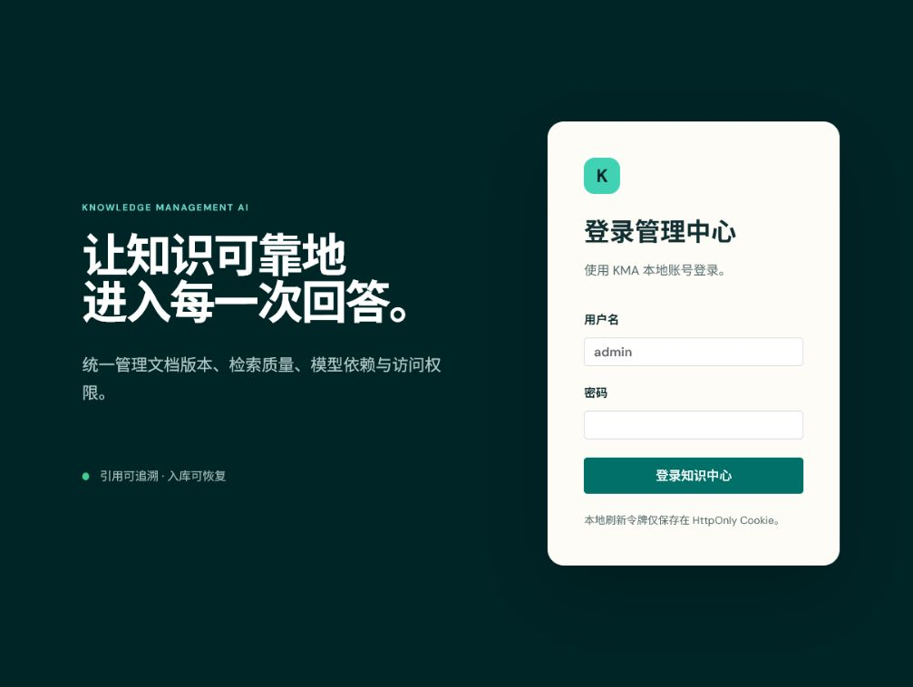
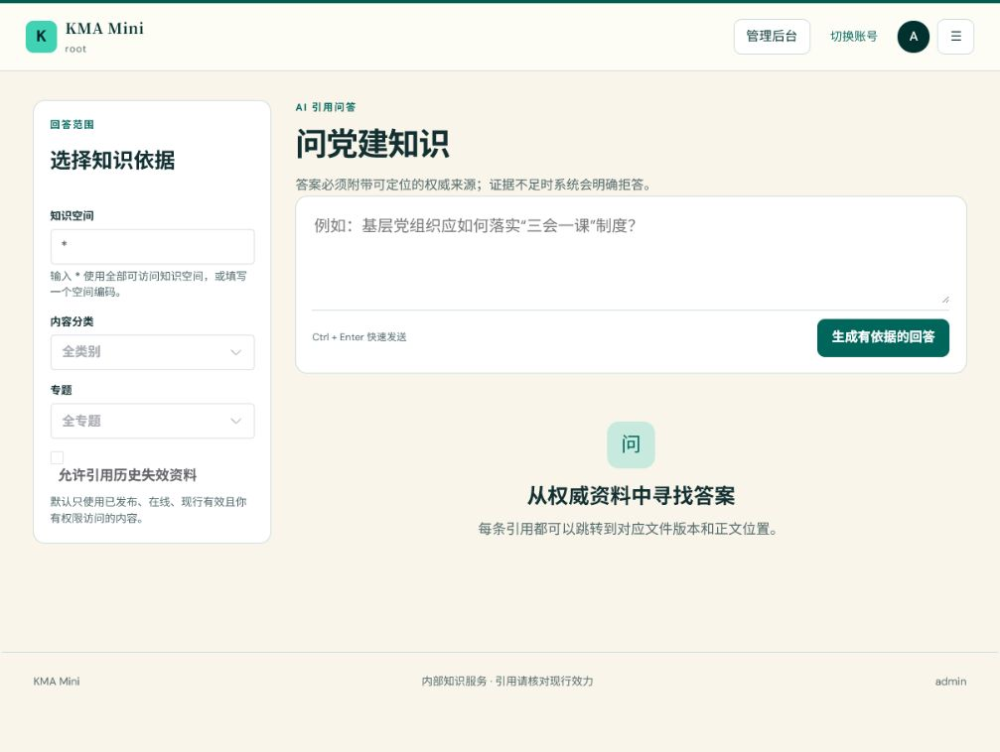
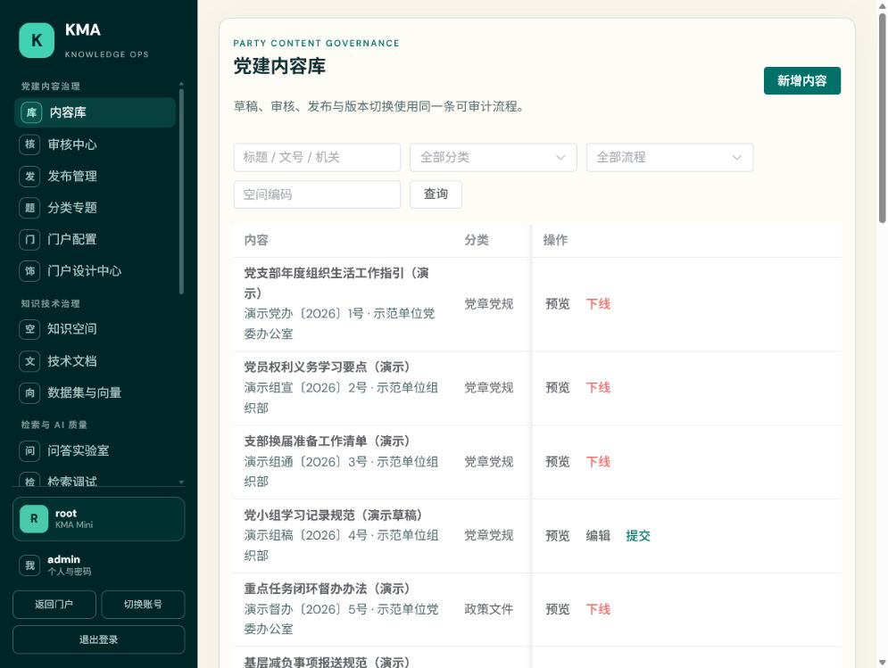
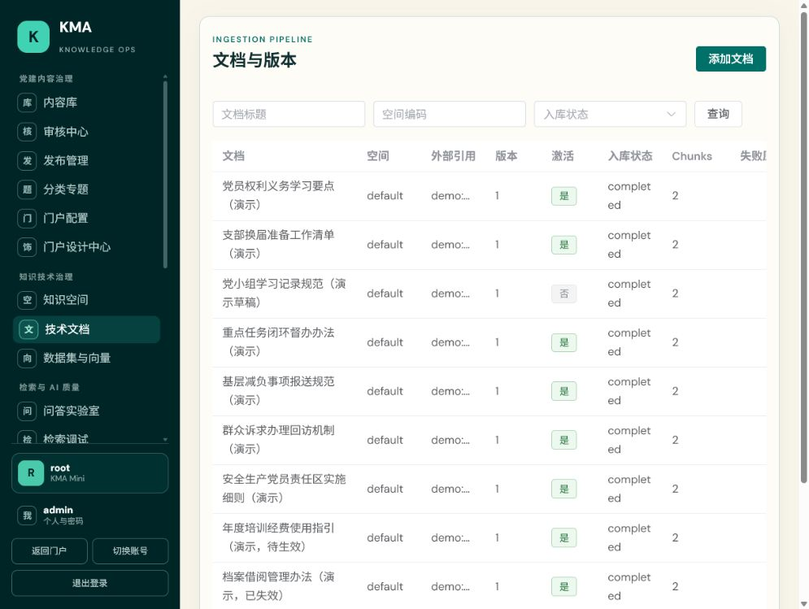
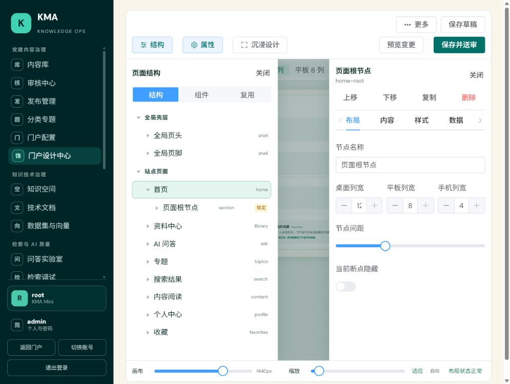

# KMA Mini 使用说明手册

> 适用版本：KMA Mini 单实例演示版。本文档基于本机 `kma_mini` 演示环境编写，仅用于学习、演示和内部验证；不代表生产就绪承诺。

## 目录

1. [产品与角色](#1-产品与角色)
2. [门户使用](#2-门户使用)
3. [内容治理](#3-内容治理)
4. [知识技术治理](#4-知识技术治理)
5. [门户运营](#5-门户运营)
6. [系统管理与运维](#6-系统管理与运维)
7. [流程图](#7-流程图)

## 1. 产品与角色

KMA Mini 是物理单实例 AI 知识库。它把经过治理的内容转化为可检索、可引用的知识，并通过知识门户提供资料阅读与 AI 问答。

`/p/{siteKey}` 中的 `siteKey` 表示 CMS 门户站点和视觉/页面配置，**不是**数据库、租户或数据隔离边界。

| 角色 | 主要目标 | 常用区域 |
| --- | --- | --- |
| 普通门户用户 | 查找资料、学习专题、获取带引用的回答 | 首页、资料中心、AI 问答、收藏历史 |
| 内容管理员 | 管理内容质量、专题与发布状态 | 内容库、审核中心、发布管理、分类专题 |
| 知识技术管理员 | 管理空间、文档处理、数据与 RAG 质量 | 知识空间、技术文档、数据集与向量、检索调试、RAG 评测 |
| 系统管理员 | 管理人员、权限、模型、任务、存储与审计 | 用户、角色、组织、运行概览、模型配置、任务与死信 |

内容治理决定“哪些内容可信且可用”；知识技术治理决定“系统如何解析、检索和引用这些内容”。两者共同决定 AI 问答质量。

## 2. 门户使用

### 2.1 登录与个人中心

**前置权限**：有效本地账号。首次使用临时密码时，系统会要求修改密码。

**操作步骤**：打开 `http://localhost:27183/login`，输入账号和密码；登录后在个人中心修改密码或退出会话。

**结果验证**：可访问默认门户 `/p/default/home`；无权限模块会显示无权访问或功能未启用。

**注意事项**：不要在手册、截图或工单中记录密码、Access Token、Refresh Token 或模型密钥。

### 2.2 资料中心、专题与正文

**前置权限**：`content:read`，且满足所属知识空间 ACL。

**操作步骤**：在“资料中心”按关键词、专题、内容类型或效力状态筛选；点击资料打开正文；在“专题学习”查看专题目录和关联内容。

**结果验证**：仅展示已发布、在线且位于可访问范围内的资料。正文可查看来源、效力、专题和阅读位置。

### 2.3 AI 问答与引用

**前置权限**：`qa:use`，且满足资料空间 ACL。

**操作步骤**：打开“AI 问答”，输入问题；按需限制知识空间、内容分类、专题或单篇文档；提交后查看回答及引用卡片。

**结果验证**：证据充分时显示“基于资料回答”及可跳转引用；证据不足时系统明确拒答，不伪造答案。

**注意事项**：问答仅是资料辅助，不替代正式发布、审签或业务决策。

## 3. 内容治理

### 3.1 内容库与生命周期

**前置权限**：查看需要 `content:read`；审核需要 `content:review`；发布需要 `content:publish`。

**操作步骤**：在“内容库”新建或编辑内容，补全标题、来源、效力、摘要、关键词和专题；提交后由审核人员处理；审核通过后由发布人员发布；必要时下线或修订。

**结果验证**：草稿与审核中内容不进入门户；发布后才可被门户搜索与 AI 问答使用；下线或失效内容按门户范围策略停止展示或被历史筛选控制。

**注意事项**：审核、发布和下线是不同权限；不要把“保存草稿”误认为“已发布”。

### 3.2 分类专题

**前置权限**：`topic:manage`。

**操作步骤**：在“分类专题”维护专题名称、图标、颜色、展示顺序和关联规则；为已发布内容关联合适专题。

**结果验证**：门户专题目录和资料筛选可看到新的关联；未经发布的内容仍不可被普通门户用户访问。

## 4. 知识技术治理

### 4.1 知识空间与 ACL

**前置权限**：查看需要 `space:read`；变更空间和 ACL 需要相应管理权限。

**操作步骤**：创建或维护知识空间，设置空间状态；在 ACL 中为用户、角色或组织配置访问范围；需要时触发重建索引。

**结果验证**：访问者同时满足 RBAC 和空间 ACL 后才可读取内容、检索资料或用于问答。

### 4.2 技术文档、数据集与向量

**前置权限**：技术文档 `document:read`，数据集 `dataset:read`。

**操作步骤**：在“技术文档”观察上传、解析、分块与入库任务；在“数据集与向量”查看数据集、向量状态和重建进度；异常时转到“任务与死信”处理。

**结果验证**：成功处理的内容具备可检索分块；失败任务显示可诊断状态、重试或死信记录。

### 4.3 检索、问答与评测

**前置权限**：分别为 `retrieval:use`、`qa:use`、`evaluation:read`。

**操作步骤**：用“检索调试”查看召回结果与过滤；用“问答实验室”验证回答和引用；用“RAG 评测”维护评测集并观察 Recall@K、MRR、正确率、引用准确率和拒答率。

**结果验证**：可追溯问题使用了哪些资料，且无证据场景出现拒答而非编造。

## 5. 门户运营

### 5.1 门户配置与设计中心

**前置权限**：门户基础配置需要 `portal:configure`；设计器读取需要 `portal-site:read`，编辑需要 `portal-site:update` 与 `portal-page:edit`。

**操作步骤**：在“门户配置”设置站点基础能力；在“门户设计中心”编辑页面结构、组件属性、主题和内容范围。AI 设计仅生成候选方案，须人工审阅并应用。

**结果验证**：编辑即时反映在设计画布；应用 AI 提案后仍是未保存草稿，不会自动审核或发布。

### 5.2 保存、预览、送审与发布

**前置权限**：编辑、审核、发布分别需要对应门户权限。

**操作步骤**：编辑后先“保存草稿”；点击“预览变更”在真实门户路由查看指定版本；确认后“保存并送审”；审核人员通过或驳回；发布人员确认“发布门户”。

**结果验证**：预览顶部显示“预览中 · Vx”，使用真实资料数据，但不修改已发布指针；发布为原子切换，旧版本保留用于回退。

**注意事项**：预览链接仅面向已登录且具编辑权限的用户，不能作为公开分享链接。

## 6. 系统管理与运维

### 6.1 用户、角色与组织

**前置权限**：用户、角色、组织管理分别需要相应 `user:*`、`role:*`、`org:*` 权限。

**操作步骤**：创建用户并分配角色；通过角色授予最小必要权限；维护组织归属；再通过知识空间 ACL 授予内容范围。

**结果验证**：新权限在令牌刷新后生效；无权用户不能通过前端路由或 API 绕过授权。

### 6.2 模型、任务、存储与审计

**前置权限**：分别为模型、任务、存储、审计的读取或管理权限。

**操作步骤**：在运行概览查看依赖状态；在模型配置维护 Profile 与主备链；在任务与死信诊断重试失败；在存储生命周期进行对账；在审计页追踪调用与安全事件。

**结果验证**：模型不可用时能力显示降级或明确错误；任务不会静默丢失；审计记录可追溯管理操作。

### 6.3 本机启动与维护

1. 确认 PostgreSQL 目标为 `kma_mini`，并启用 `vector` 扩展。
2. 通过进程环境变量提供 `KMA_DB_URL`、`KMA_DB_USERNAME`、`KMA_DB_PASSWORD`、JWT 密钥；不得写入仓库。
3. 启动后端 API（8090）、前端（27183）；分进程模式另启动 Worker。
4. 用 `/actuator/health/readiness` 验证 API 为 `UP`；打开前端登录页验证代理可用。
5. 演示环境需要资料时运行受保护的 `scripts/seed-demo-portal-data.ps1`；该脚本拒绝连接 `kma`。

**常见问题**：

- 登录 401：确认前后端使用同一正在运行的 API，会话因 JWT 密钥重启失效时重新登录。
- 门户无内容：检查内容是否已发布、知识空间 ACL、门户内容范围和效力状态。
- 问答无引用：检查已发布内容是否完成解析/分块、检索范围、模型 Profile 和任务状态。
- 入库积压：检查 Worker、任务租约、死信原因及外部模型/存储依赖。

## 7. 流程图

| 编号 | 图名 | Mermaid 源 |
| --- | --- | --- |
| 1 | 端到端业务总览 | [01-end-to-end-overview.mmd](diagrams/01-end-to-end-overview.mmd) |
| 2 | 内容生命周期 | [02-content-lifecycle.mmd](diagrams/02-content-lifecycle.mmd) |
| 3 | AI 知识库链路 | [03-ai-knowledge-pipeline.mmd](diagrams/03-ai-knowledge-pipeline.mmd) |
| 4 | 权限访问链路 | [04-permission-access.mmd](diagrams/04-permission-access.mmd) |
| 5 | 门户设计发布链路 | [05-portal-design-release.mmd](diagrams/05-portal-design-release.mmd) |

流程图静态图与 Word 文档中的图片位于 `docs/diagrams/rendered/`。维护流程时先更新 `.mmd` 源文件，再重新渲染静态图和 Word。
