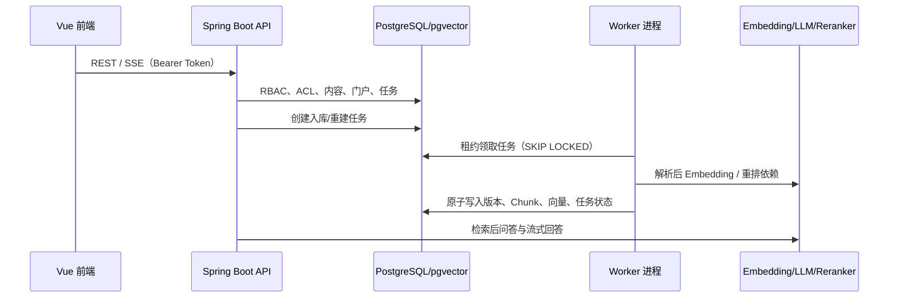
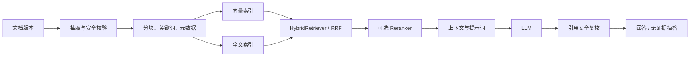
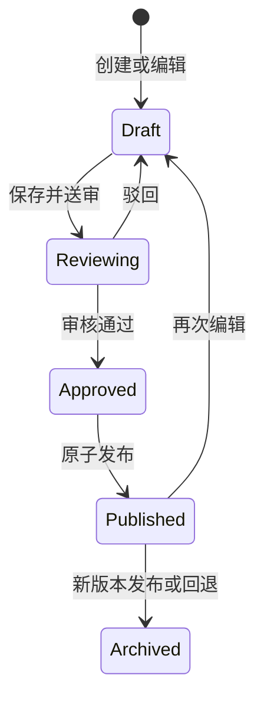

# KMA Mini 技术架构与代码阅读指南

KMA Mini 是单实例的模块化单体：业务代码在一个 Spring Boot 工程内，API 和 Worker 复用同一 JAR 与数据库模型，但可作为独立进程部署。本文面向开发、运维和技术评审，补充 [README](../README.md) 的实现细节。

> KMA Mini 的 CMS 多站点用于门户页面、主题和内容范围编排；它不形成租户、数据库或行级隔离。历史 SQL 中的 tenant 命名是迁移历史，当前结构以 V22 的单实例收敛结果为准。

## 1. 运行模型

| 进程 | 责任 | 关键开关 |
| --- | --- | --- |
| API | REST、SSE、认证、授权、内容/门户管理、创建异步任务 | 默认 Web 模式 |
| Worker | 入库、Embedding 重建、Feed、治理定时任务 | `KMA_INGESTION_WORKER_ENABLED`、`KMA_FEED_ENABLED`、`KMA_GOVERNANCE_ENABLED` |
| PostgreSQL | 事务、向量、全文索引、任务租约、Flyway 历史 | `KMA_DB_URL` 指向 `kma_mini` |

API 默认不执行入库任务；开发演示可合并 Worker，部署应拆分进程以便独立扩容和故障隔离。

## 2. 后端分层与阅读入口

| 区域 | 职责 | 推荐入口 |
| --- | --- | --- |
| `common` | 统一响应、异常、Trace、Spring Security、本地令牌、审计与 Web 基础设施 | `KmaApplication`、`SecurityConfig`、`KmaLocalAuthService` |
| `knowledge.controller` | REST/SSE 管理面、门户面、RAG 面接口 | `KnowledgeQAController`、`PortalSiteController`、`PortalSiteAdminController` |
| `knowledge.service` | 业务编排、空间 ACL、内容/门户、评测、模型 Profile | `KnowledgeIngestionService`、`PortalSiteService`、`ModelProfileResolver` |
| `knowledge.rag` | 文档抽取、分块、检索、提示词、入库流水线 | `IngestionPipeline`、`HybridRetriever`、`KnowledgeQAServiceImpl` |
| `knowledge.worker` | 计划调度、领取任务、重试、死信 | `IngestionJobWorker` |
| `knowledge.client` | OpenAI-compatible Embedding/LLM/Reranker Provider 适配 | 各 provider Client 与 Profile Resolver |
| `knowledge.storage` | Local 与 MinIO 存储、对象元数据、对账清理 | `KnowledgeStorage`、`StorageLifecycleService` |
| `mapper` / `entity` | MyBatis SQL、实体与数据库映射 | `KnowledgeIngestionJobMapper`、`KnowledgeChunkMapper.xml` |

所有配置集中于 `src/main/resources/application.yml` 与 `KnowledgeProperties`。控制器只接收/返回 DTO；权限和范围判断应在 Service 层统一执行，不在前端或 Mapper 中复制。

## 3. 数据与任务设计

### 3.1 迁移与核心域

Flyway 从 V1 演进到 V22：基础 Schema、默认知识空间、可靠入库、全文检索、身份访问、模型 Profile、版本化向量、RAG 评测、存储生命周期、粒度授权、党建门户、多站点 CMS、视觉包、低代码 V3，最终由 V22 清理多租户残留并收敛为单实例结构。

核心域包括：

- 身份：用户、角色、权限、组织及授权版本。
- 知识：空间、ACL、文档、版本、Chunk、向量、数据集与模型 Profile。
- 任务：入库、Embedding 重建、Feed、治理任务和死信状态。
- 内容：草稿、审核、发布、下线、专题、效力、收藏、阅读历史。
- CMS：站点、不可变配置版本、内容范围编译、扩展/代码包、资产和访问分析。

### 3.2 原子处理与存储

文档处理先进入 staging。解析、分块、Embedding 和索引成功后才原子切换为可用版本，避免半成品进入检索。对象存储通过 `KnowledgeStorage` 抽象支持本地文件与 MinIO；生命周期服务负责对象引用、校验和、对账与孤儿清理。

任务领取使用 `FOR UPDATE SKIP LOCKED` 和租约。Worker 在失败时按指数退避重新调度；`NonRetryableIngestionException` 或超出最大次数后转为死信，保留可诊断错误信息。

## 4. RAG 与模型链路

- `HybridRetriever` 融合向量与全文结果，RRF 常量为 60；Reranker 失败时保留 RRF 排序。
- 请求先按 RBAC、组织和空间 ACL 过滤；门户还叠加站点发布内容范围。
- `CitationSecurityService` 复核回答引用；没有足够证据时使用受控拒答文本，不生成无依据结论。
- Embedding、LLM、Reranker 使用 Profile 与主备回退链；密钥只通过环境变量或 `SecretProvider` 注入。
- RAG 评测记录 Recall@K、MRR、引用准确率、拒答率、答案正确率和延迟，可作为发布门禁。

## 5. CMS、门户与预览

门户配置以版本化 JSON 保存。V3 使用响应式布局树，包含全局页头/页脚、系统页面根节点、组件属性 Schema、数据源、动作、样式和可复用区块。

- 设计器的真实预览通过受保护的管理员版本接口读取草稿/审核版本；携带 `previewVersion` 的门户路由绕过已发布缓存。
- 预览使用该版本的页面、主题、扩展和内容范围，但绝不写入发布指针、审核状态或版本锁。
- 扩展包仅允许平台 CI 签名产物；前端静态代码能力处于受控沙箱边界，站点管理员不能执行任意 JavaScript。

## 6. 前端架构

前端模块按 `portal`、`governance`、`knowledge`、`intelligence`、`operations`、`access`、`platform` 注册。每个模块声明路由、导航、功能键和所需权限。

| 层 | 责任 |
| --- | --- |
| `modules` | 功能清单与权限驱动导航 |
| `router` | 路由守卫、登录、站点初始化、遗留 `/portal` 兼容 |
| `api` | OpenAPI 类型客户端、分页/错误规范化、SSE |
| `stores` | 身份、门户 Bootstrap、主题与运行时状态 |
| `cms` | V2/V3 配置契约、布局渲染、组件库、门户扩展 |
| `views` | 控制台和门户业务界面 |

`portalSite` Store 将站点 Bootstrap、主题 Token 和预览版本作为同一缓存维度。预览内容、正文和问答请求会切换到管理员版本预览端点，防止草稿范围被已发布版本缓存污染。

## 7. 安全、运行与排障

### 配置分类

| 分类 | 示例 | 规则 |
| --- | --- | --- |
| 数据库 | `KMA_DB_URL`、`KMA_DB_PASSWORD` | 仅 `kma_mini`，密码经环境变量/Secret 注入 |
| 身份 | `KMA_AUTH_JWT_SECRET`、Bootstrap 管理员密码 | 不进仓库；更换 JWT 密钥会使旧会话失效 |
| 模型 | `KMA_*_API_KEY`、Endpoint、Model | Key 不落库、不写日志、不回传前端 |
| Worker | `KMA_INGESTION_WORKER_ENABLED` 等 | API 与 Worker 使用同一数据库和 JWT 配置 |
| 存储 | `KMA_STORAGE_TYPE`、MinIO 凭据 | 本地开发默认 local，生产可切换 S3 兼容存储 |

### 排障顺序

1. 检查 `/actuator/health/readiness` 与 `/actuator/health/liveness`。
2. 检查数据库连接、Flyway 历史和 Worker 开关是否匹配当前进程。
3. 内容不可见时依次检查发布状态、效力、站点范围、RBAC 与空间 ACL。
4. 问答无引用时检查文档版本、Chunk/索引、检索过滤、模型 Profile 与任务/死信。
5. 入库积压时检查 Worker 日志、租约、重试次数、外部模型/OCR/存储可达性。
6. 门户预览失败时检查编辑权限、版本状态和 `previewVersion`，确认公开门户未受影响。

Prometheus 指标由 Actuator 暴露；调用与安全审计在控制台审计模块查看。日志默认写入 `logs/kma.log`，生产环境应集中收集并限制访问。

## 8. 开发约定与验证

- 不修改已经应用的 Flyway 历史；结构变更新增迁移。
- 不在服务端或前端写入数据库密码、JWT、模型 Key 或可复用 Token。
- HTTP DTO 以 OpenAPI 为单一契约来源；更新接口后重新生成前端类型。
- 新模块在 `modules` 注册权限、导航与懒加载路由；不可只添加页面文件。
- 任何内容访问都必须经过 RBAC 与空间 ACL；门户还必须服从已发布/预览范围。

执行命令见 [README 的质量与验证章节](../README.md#质量与验证)。
